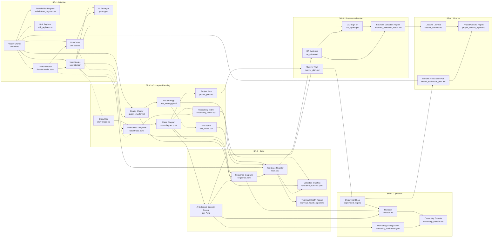

# Unified Delivery Framework (UDF)

Diseño de un marco híbrido, pragmático y trazable que cruza ICONIX con las mejores prácticas de gobierno, calidad y entrega. Compatible con PMBOK, PRINCE2 y SAFe, integra métricas técnicas, artefactos YAML, control de calidad automatizado, gobernanza y aprendizaje continuo.

**Adopción modular:** el UDF es un **catálogo** de fases, artefactos, evidencia y gobierno que activás según contexto ([Delivery Cube](https://github.com/akasha-code/UDF/wiki/11-delivery-cube): PDI, DSI, QEI, TTI). No es obligatorio adoptar toda la profundidad documental ni la capa portfolio/financiera/comités formales: elegí el **núcleo** mínimo y sumá extensiones solo si el proyecto lo requiere. Detalle en [Núcleo, extensiones e interoperabilidad](https://github.com/akasha-code/UDF/wiki/17-interoperabilidad-y-automatizacion).

**Perfil automatización / orquestación:** contratos de handoff, estados de artefacto y matriz de capacidades para integrar herramientas o agentes con los mismos Stage Reviews y gates están descritos en esa misma wiki y en las plantillas [`templates/automation/`](templates/automation/).

> **📖 Documentación Completa:** Toda la documentación y el manual completo están disponibles en la [GitHub Wiki](https://github.com/akasha-code/UDF/wiki)
>
> **💡 Este repositorio:** Contiene ejemplos prácticos, plantillas y la estructura del framework

## Mapa de artefactos y dependencias por fase

Este mapa muestra **dependencias entre artefactos** (no tareas): lectura **izquierda → derecha** por fase (SR-I … SR-X); dentro de cada columna el flujo típico es **de arriba abajo**. **Convención:** A → B indica que *B se apoya en, deriva de o debe ser coherente con* A. Las aristas **punteadas** cruzan el límite de la fase anterior. **Entre fases** el avance formal pasa por **Stage Reviews** (Go/No-Go); los ciclos de refinamiento entre artefactos no se dibujan para mantener el gráfico legible.

Los nodos muestran **nombre en inglés** (presentación) y **archivo** en la segunda línea.



**Notas al diagrama:** las actas de Stage Review (`stage_review_board.md`), informes de estado (`status_report.md`) y resumen ejecutivo (`executive_summary.md`) agregan evidencia de múltiples artefactos y no se enlazan desde cada nodo. `validation_manifest.yaml` es un único artefacto (Build y testing). `architecture_governance_matrix.md`, `qa_gate_policy.md`, `test_catalog.md` y aprendizaje (`learning/`, `knowledge_base/`, `tech_talks/`) pueden enlazarse según PDI. Listado de artefactos por fase: [Artefactos (wiki)](https://github.com/akasha-code/UDF/wiki/02-artifacts).

<details>
<summary><strong>Mapeo archivo → nombre para presentación (EN / ES)</strong></summary>

### Por fase (entregables principales)

| Archivo / ruta | Nombre (EN) | Nombre (ES) |
| ---------------- | ------------- | ------------- |
| `charter.md` | Project Charter | Charter del proyecto / Acta de constitución |
| `domain-model.puml` | Domain Model | Modelo de dominio |
| `use-cases/` | Use Cases | Casos de uso |
| `user-stories/` | User Stories | Historias de usuario |
| `prototype/` | UI Prototype | Prototipo de interfaz |
| `story-maps.md` | Story Map | Mapa de historias |
| `robustness.puml` | Robustness Diagrams | Diagramas de robustez |
| `class-diagram.puml` | Class Diagram | Diagrama de clases |
| `project_plan.md` | Project Plan | Plan de proyecto |
| `traceability_matrix.csv` | Traceability Matrix | Matriz de trazabilidad |
| `sequence.puml` | Sequence Diagrams | Diagramas de secuencia |
| `tests.csv` | Test Case Register | Registro de casos de prueba |
| `adr_<id>.md` | Architecture Decision Record (ADR) | Registro de decisiones de arquitectura (ADR) |
| `technical_health_report.md` | Technical Health Report | Informe de salud técnica |
| `validation_manifest.yaml` | Validation Manifest | Manifiesto de validación |
| `cutover_plan.md` | Cutover Plan | Plan de corte / puesta en marcha |
| `qa_evidence/` | QA Evidence Package | Evidencias de QA |
| `uat_signoff.pdf` | UAT Sign-off | Acta de aceptación de usuario (UAT) |
| `business_validation_report.md` | Business Validation Report | Informe de validación de negocio |
| `deployment_log.md` | Deployment Log | Registro de despliegues |
| `monitoring_dashboard.yaml` | Monitoring Configuration | Configuración de monitoreo / dashboards |
| `runbook.md` | Runbook | Manual operativo (runbook) |
| `ownership_transfer.md` | Ownership Transfer | Transferencia de responsabilidad operativa |
| `lessons_learned.md` | Lessons Learned | Lecciones aprendidas |
| `benefit_realization_plan.md` | Benefits Realization Plan | Plan de realización de beneficios |
| `project_closure_report.md` | Project Closure Report | Informe de cierre del proyecto |

### Gobierno y calidad (transversales)

| Archivo / ruta | Nombre (EN) | Nombre (ES) |
| ---------------- | ------------- | ------------- |
| `quality_charter.md` | Quality Charter | Carta de calidad |
| `architecture_governance_matrix.md` | Architecture Governance Matrix | Matriz de gobierno arquitectónico |
| `stage_review_board.md` | Stage Review Records | Actas de Stage Reviews |
| `risk_register.csv` | Risk Register | Registro de riesgos |
| `stakeholder_register.csv` | Stakeholder Register | Registro de partes interesadas |
| `status_report.md` | Status Report | Informe de estado |
| `executive_summary.md` | Executive Summary | Resumen ejecutivo |

### Testing (estrategia y políticas)

| Archivo / ruta | Nombre (EN) | Nombre (ES) |
| ---------------- | ------------- | ------------- |
| `test_strategy.yaml` | Test Strategy | Estrategia de pruebas |
| `test_matrix.csv` | Test Matrix | Matriz de pruebas |
| `qa_gate_policy.md` | QA Gate Policy | Política de gates de QA |
| `test_catalog.md` | Test Techniques Catalog | Catálogo de técnicas de prueba |

### Aprendizaje

| Archivo / ruta | Nombre (EN) | Nombre (ES) |
| ---------------- | ------------- | ------------- |
| `learning/<fecha>-<tema>.md` | Learning Log Entry | Entrada del ciclo de aprendizaje |
| `knowledge_base/` | Knowledge Base | Base de conocimiento |
| `tech_talks/` | Tech Talks | Charlas técnicas |

</details>

## 📚 Documentación

La documentación completa del UDF está disponible en la [GitHub Wiki](https://github.com/akasha-code/UDF/wiki):

### Contenido Principal

0. **[Overview](https://github.com/akasha-code/UDF/wiki/00-overview)** - Resumen ejecutivo y navegación
1. **[Fases del ciclo de vida](https://github.com/akasha-code/UDF/wiki/01-lifecycle-phases)** - Initiation, Planning, Build, Validation, Operation, Closure
2. **[Artefactos principales](https://github.com/akasha-code/UDF/wiki/02-artifacts)** - Plantillas y documentos estándar
3. **[Gestión técnica y CI/CD](https://github.com/akasha-code/UDF/wiki/03-technical-management)** - Technical Health Index, automation
4. **[Gobierno y Project Management](https://github.com/akasha-code/UDF/wiki/04-governance)** - Stage Reviews, control de cambios
5. **[Roles, Interacciones y Responsabilidades](https://github.com/akasha-code/UDF/wiki/05-roles-interactions)** - RACI, topologías de equipo
6. **[Calidad y pruebas](https://github.com/akasha-code/UDF/wiki/06-quality-testing)** - QEI, Quality Charter, testing
7. **[Arquitectura y observabilidad](https://github.com/akasha-code/UDF/wiki/07-architecture)** - ADRs, SLOs, monitoring
8. **[Producto y valor](https://github.com/akasha-code/UDF/wiki/08-product-value)** - User stories, outcome metrics
9. **[Portfolio y planificación](https://github.com/akasha-code/UDF/wiki/09-portfolio)** - OKRs, roadmaps, multi-proyecto
10. **[Learning Loop activo](https://github.com/akasha-code/UDF/wiki/10-learning-loop)** - Captura de aprendizajes
11. **[Delivery Cube (PDI–DSI–QEI–TTI)](https://github.com/akasha-code/UDF/wiki/11-delivery-cube)** - Configuración del framework
12. **[Gobierno y aprendizaje](https://github.com/akasha-code/UDF/wiki/12-governance-learning)** - Stage Reviews detallados
13. **[Testing, riesgo y madurez](https://github.com/akasha-code/UDF/wiki/13-testing-risk-maturity)** - Gestión proporcional
14. **[Plan de adopción](https://github.com/akasha-code/UDF/wiki/14-adoption-plan)** - Roadmap de implementación
15. **[Síntesis](https://github.com/akasha-code/UDF/wiki/15-synthesis)** - Resumen integral del UDF
16. **[Unified Test Strategy (UTS)](https://github.com/akasha-code/UDF/wiki/16-unified-test-strategy)** - Estrategia completa de testing
17. **[Interoperabilidad y automatización](https://github.com/akasha-code/UDF/wiki/17-interoperabilidad-y-automatizacion)** - Núcleo vs extensiones; perfil agent-ready (handoff, estados, capacidades, gates verificables)

## 🚀 Quick Start

### 1. Evalúa tu contexto

Determina tu configuración inicial:
- **PDI** (Depth): XS, S, M, L, XL - ¿Cuánta profundidad documental necesitas?
- **DSI** (Structure): 1-5 - ¿Qué tan iterativo es tu proceso?
- **QEI** (Quality): Low, Medium, High - ¿Cuánto énfasis en calidad?
- **TTI** (Topology): Integrated, Dedicated, External - ¿Cómo se estructura tu equipo?

### 2. Comienza con lo mínimo

Para un proyecto básico (PDI: XS):
```
project/
├── charter.md                    # Visión y alcance
├── user-stories/                 # Requisitos
├── tests.csv                     # Plan de pruebas
├── technical_health_report.md    # Métricas técnicas
└── stage_review_board.md         # Decisiones y governance
```

### 3. Ejecuta tu primer Stage Review

- Usa las plantillas en la [Wiki de Governance](https://github.com/akasha-code/UDF/wiki/04-governance)
- Revisa objetivos, entregables y criterios Go/No-Go
- Documenta decisiones

### 4. Mide y aprende

- Calcula tu Technical Health Index (THI)
- Captura aprendizajes en `learning/`
- Ajusta tu configuración según resultados

## 💡 Casos de uso

### Startup MVP
```yaml
pdi: XS
dsi: 5
qei: low
tti: integrated
# Enfoque: velocidad, aprendizaje, iteración rápida
```

### Producto Corporativo
```yaml
pdi: M
dsi: 3
qei: medium
tti: integrated
# Enfoque: balance agilidad-control, calidad estándar
```

### Sistema Regulado
```yaml
pdi: XL
dsi: 1
qei: high
tti: external
# Enfoque: compliance, trazabilidad completa, V-Model
```

## 🎯 Beneficios clave

- ✅ **Trazabilidad completa** desde requisitos hasta valor entregado
- ✅ **Decisiones basadas en evidencia** mediante THI y métricas
- ✅ **Adaptable** a cualquier metodología (Agile, Waterfall, DevOps, V-Model)
- ✅ **Configurable** según contexto y madurez
- ✅ **Aprendizaje continuo** incorporado en el proceso
- ✅ **Interoperable** con PMBOK, PRINCE2, SAFe, ISO

## 🔧 Herramientas recomendadas

- **Documentación:** Markdown, PlantUML, YAML
- **CI/CD:** GitHub Actions, GitLab CI, Jenkins
- **Quality:** SonarQube, Snyk, ESLint
- **Testing:** Jest, Playwright, k6, TestContainers
- **Monitoring:** Prometheus, Grafana, ELK Stack
- **Project Management:** JIRA, Linear, GitHub Projects

## 📖 Recursos adicionales

- [Núcleo, extensiones e interoperabilidad (wiki 17)](https://github.com/akasha-code/UDF/wiki/17-interoperabilidad-y-automatizacion)
- [Plantillas automation (handoff, manifiestos, gates)](templates/automation/)
- [Plan de adopción paso a paso](https://github.com/akasha-code/UDF/wiki/14-adoption-plan)
- [Unified Test Strategy completa](https://github.com/akasha-code/UDF/wiki/16-unified-test-strategy)
- [Ejemplos de V-Model en contextos regulados](https://github.com/akasha-code/UDF/wiki/05-roles-interactions#55-ejemplo-operativo-de-v-model-dentro-del-udf)
- [Calculadora de madurez organizacional](https://github.com/akasha-code/UDF/wiki/13-testing-risk-maturity#madurez-organizacional)

## 🤝 Contribución

El UDF es un **living framework** que evoluciona con feedback de la comunidad. Sugerencias y mejoras son bienvenidas.

## 📄 Licencia

Ver archivo [LICENSE](LICENSE) para detalles.

---

> "El UDF no te dice **qué** construir, te da **cómo** construir con evidencia, trazabilidad y aprendizaje continuo."
