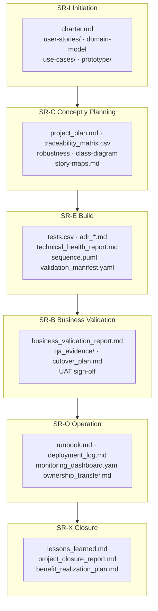
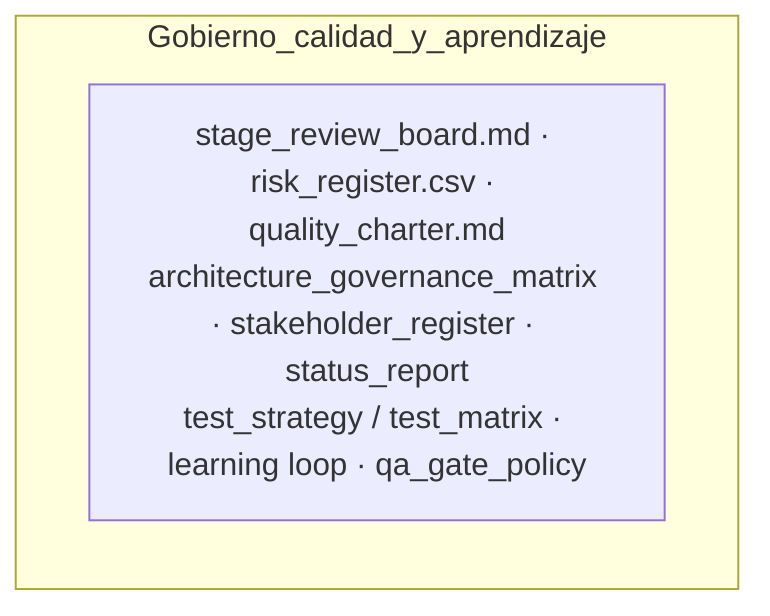

# Unified Delivery Framework (UDF)

Diseño de un marco híbrido, pragmático y trazable que cruza ICONIX con las mejores prácticas de gobierno, calidad y entrega. Compatible con PMBOK, PRINCE2 y SAFe, integra métricas técnicas, artefactos YAML, control de calidad automatizado, gobernanza y aprendizaje continuo.

**Adopción modular:** el UDF es un **catálogo** de fases, artefactos, evidencia y gobierno que activás según contexto ([Delivery Cube](https://github.com/akasha-code/UDF/wiki/11-delivery-cube): PDI, DSI, QEI, TTI). No es obligatorio adoptar toda la profundidad documental ni la capa portfolio/financiera/comités formales: elegí el **núcleo** mínimo y sumá extensiones solo si el proyecto lo requiere. Detalle en [Núcleo, extensiones e interoperabilidad](https://github.com/akasha-code/UDF/wiki/17-interoperabilidad-y-automatizacion).

**Perfil automatización / orquestación:** contratos de handoff, estados de artefacto y matriz de capacidades para integrar herramientas o agentes con los mismos Stage Reviews y gates están descritos en esa misma wiki y en las plantillas [`templates/automation/`](templates/automation/).

> **📖 Documentación Completa:** Toda la documentación y el manual completo están disponibles en la [GitHub Wiki](https://github.com/akasha-code/UDF/wiki)
>
> **💡 Este repositorio:** Contiene ejemplos prácticos, plantillas y la estructura del framework

## Vista panorámica: artefactos por fase

Cada fase del ciclo de vida produce **entregables documentados**; el conjunto exacto depende del **PDI** (profundidad) y del contexto. Lo siguiente es el **mapa estándar** del framework. Detalle y plantillas en [Artefactos principales (wiki)](https://github.com/akasha-code/UDF/wiki/02-artifacts).

### Flujo del ciclo de vida y entregables por Stage Review



### Artefactos transversales (todo el ciclo)

Gobernanza, calidad y riesgo acompañan las fases anteriores; no pertenecen a una sola etapa.



## 📚 Documentación

La documentación completa del UDF está disponible en la [GitHub Wiki](https://github.com/akasha-code/UDF/wiki):

### Contenido Principal

0. **[Overview](https://github.com/akasha-code/UDF/wiki/00-overview)** - Resumen ejecutivo y navegación
1. **[Fases del ciclo de vida](https://github.com/akasha-code/UDF/wiki/01-lifecycle-phases)** - Initiation, Planning, Build, Validation, Operation, Closure
2. **[Artefactos principales](https://github.com/akasha-code/UDF/wiki/02-artifacts)** - Plantillas y documentos estándar
3. **[Gestión técnica y CI/CD](https://github.com/akasha-code/UDF/wiki/03-technical-management)** - Technical Health Index, automation
4. **[Gobierno y Project Management](https://github.com/akasha-code/UDF/wiki/04-governance)** - Stage Reviews, control de cambios
5. **[Roles, Interacciones y Responsabilidades](https://github.com/akasha-code/UDF/wiki/05-roles-interactions)** - RACI, topologías de equipo
6. **[Calidad y pruebas](https://github.com/akasha-code/UDF/wiki/06-quality-testing)** - QEI, Quality Charter, testing
7. **[Arquitectura y observabilidad](https://github.com/akasha-code/UDF/wiki/07-architecture)** - ADRs, SLOs, monitoring
8. **[Producto y valor](https://github.com/akasha-code/UDF/wiki/08-product-value)** - User stories, outcome metrics
9. **[Portfolio y planificación](https://github.com/akasha-code/UDF/wiki/09-portfolio)** - OKRs, roadmaps, multi-proyecto
10. **[Learning Loop activo](https://github.com/akasha-code/UDF/wiki/10-learning-loop)** - Captura de aprendizajes
11. **[Delivery Cube (PDI–DSI–QEI–TTI)](https://github.com/akasha-code/UDF/wiki/11-delivery-cube)** - Configuración del framework
12. **[Gobierno y aprendizaje](https://github.com/akasha-code/UDF/wiki/12-governance-learning)** - Stage Reviews detallados
13. **[Testing, riesgo y madurez](https://github.com/akasha-code/UDF/wiki/13-testing-risk-maturity)** - Gestión proporcional
14. **[Plan de adopción](https://github.com/akasha-code/UDF/wiki/14-adoption-plan)** - Roadmap de implementación
15. **[Síntesis](https://github.com/akasha-code/UDF/wiki/15-synthesis)** - Resumen integral del UDF
16. **[Unified Test Strategy (UTS)](https://github.com/akasha-code/UDF/wiki/16-unified-test-strategy)** - Estrategia completa de testing
17. **[Interoperabilidad y automatización](https://github.com/akasha-code/UDF/wiki/17-interoperabilidad-y-automatizacion)** - Núcleo vs extensiones; perfil agent-ready (handoff, estados, capacidades, gates verificables)

## 🚀 Quick Start

### 1. Evalúa tu contexto

Determina tu configuración inicial:
- **PDI** (Depth): XS, S, M, L, XL - ¿Cuánta profundidad documental necesitas?
- **DSI** (Structure): 1-5 - ¿Qué tan iterativo es tu proceso?
- **QEI** (Quality): Low, Medium, High - ¿Cuánto énfasis en calidad?
- **TTI** (Topology): Integrated, Dedicated, External - ¿Cómo se estructura tu equipo?

### 2. Comienza con lo mínimo

Para un proyecto básico (PDI: XS):
```
project/
├── charter.md                    # Visión y alcance
├── user-stories/                 # Requisitos
├── tests.csv                     # Plan de pruebas
├── technical_health_report.md    # Métricas técnicas
└── stage_review_board.md         # Decisiones y governance
```

### 3. Ejecuta tu primer Stage Review

- Usa las plantillas en la [Wiki de Governance](https://github.com/akasha-code/UDF/wiki/04-governance)
- Revisa objetivos, entregables y criterios Go/No-Go
- Documenta decisiones

### 4. Mide y aprende

- Calcula tu Technical Health Index (THI)
- Captura aprendizajes en `learning/`
- Ajusta tu configuración según resultados

## 💡 Casos de uso

### Startup MVP
```yaml
pdi: XS
dsi: 5
qei: low
tti: integrated
# Enfoque: velocidad, aprendizaje, iteración rápida
```

### Producto Corporativo
```yaml
pdi: M
dsi: 3
qei: medium
tti: integrated
# Enfoque: balance agilidad-control, calidad estándar
```

### Sistema Regulado
```yaml
pdi: XL
dsi: 1
qei: high
tti: external
# Enfoque: compliance, trazabilidad completa, V-Model
```

## 🎯 Beneficios clave

- ✅ **Trazabilidad completa** desde requisitos hasta valor entregado
- ✅ **Decisiones basadas en evidencia** mediante THI y métricas
- ✅ **Adaptable** a cualquier metodología (Agile, Waterfall, DevOps, V-Model)
- ✅ **Configurable** según contexto y madurez
- ✅ **Aprendizaje continuo** incorporado en el proceso
- ✅ **Interoperable** con PMBOK, PRINCE2, SAFe, ISO

## 🔧 Herramientas recomendadas

- **Documentación:** Markdown, PlantUML, YAML
- **CI/CD:** GitHub Actions, GitLab CI, Jenkins
- **Quality:** SonarQube, Snyk, ESLint
- **Testing:** Jest, Playwright, k6, TestContainers
- **Monitoring:** Prometheus, Grafana, ELK Stack
- **Project Management:** JIRA, Linear, GitHub Projects

## 📖 Recursos adicionales

- [Núcleo, extensiones e interoperabilidad (wiki 17)](https://github.com/akasha-code/UDF/wiki/17-interoperabilidad-y-automatizacion)
- [Plantillas automation (handoff, manifiestos, gates)](templates/automation/)
- [Plan de adopción paso a paso](https://github.com/akasha-code/UDF/wiki/14-adoption-plan)
- [Unified Test Strategy completa](https://github.com/akasha-code/UDF/wiki/16-unified-test-strategy)
- [Ejemplos de V-Model en contextos regulados](https://github.com/akasha-code/UDF/wiki/05-roles-interactions#55-ejemplo-operativo-de-v-model-dentro-del-udf)
- [Calculadora de madurez organizacional](https://github.com/akasha-code/UDF/wiki/13-testing-risk-maturity#madurez-organizacional)

## 🤝 Contribución

El UDF es un **living framework** que evoluciona con feedback de la comunidad. Sugerencias y mejoras son bienvenidas.

## 📄 Licencia

Ver archivo [LICENSE](LICENSE) para detalles.

---

> "El UDF no te dice **qué** construir, te da **cómo** construir con evidencia, trazabilidad y aprendizaje continuo."
