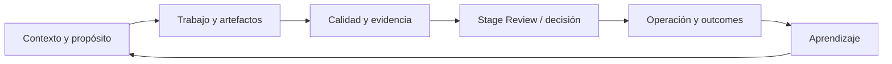
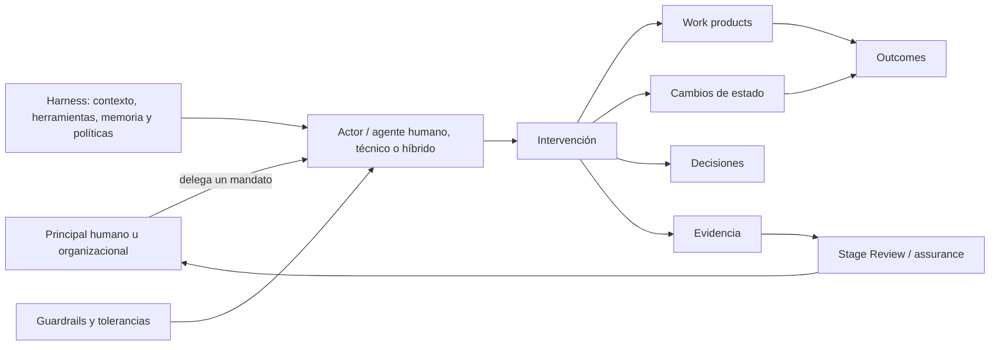
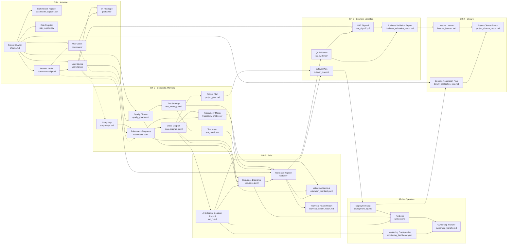

# Unified Delivery Framework (UDF)

Framework modular, pragmático y trazable para diseñar sistemas de delivery proporcionales al contexto. UDF conecta ciclo de vida, artefactos, gobierno, calidad, arquitectura, producto, operación y aprendizaje sin obligar a adoptar una metodología completa.

**Adopción modular:** el UDF es un **catálogo** de fases, artefactos, evidencia y gobierno que activás según contexto ([Delivery Cube](https://github.com/akasha-code/UDF/blob/main/wiki/11-delivery-cube.md): PDI, DSI, QEI, TTI). No es obligatorio adoptar toda la profundidad documental ni la capa portfolio/financiera/comités formales: elegí el **núcleo** mínimo y sumá extensiones solo si el proyecto lo requiere. Detalle en [Núcleo, extensiones e interoperabilidad](https://github.com/akasha-code/UDF/blob/main/wiki/17-interoperabilidad-y-automatizacion.md).

**Perspectivas opcionales:** producto, portfolio, regulación, automatización, sistemas agenticos y soberanía amplían el núcleo cuando el contexto lo requiere. La perspectiva agentica modela principales, actores, agentes, equipos, mandatos e intervenciones sin redefinir todo UDF alrededor de la IA.

> **Primera vez:** comenzá por el [overview](wiki/00-overview.md) y continuá con el [Quick Start](docs/getting-started/quick-start.md).
>
> **Referencia completa:** la fuente numerada del framework vive en [`wiki/`](wiki/README.md).

## Este repositorio y la familia UDF

Este repositorio contiene el **framework público UDF** y sus recursos comunitarios. Su licencia Apache 2.0 cubre la referencia canónica, documentación pública, schemas, templates, ejemplos y automatizaciones incluidas aquí.

| Superficie | Para qué sirve | Entrada |
| --- | --- | --- |
| **Framework** | Definiciones, modelos, artefactos y perspectivas canónicas | [`wiki/`](wiki/README.md) |
| **Documentación pública** | Introducción, arquitectura, guías y referencia | [`docs/`](docs/README.md) |
| **Recursos comunitarios** | Templates, ejemplos, schemas y skill portable | [`templates/`](templates/README.md), [`examples/`](examples/README.md), [`schemas/`](schemas/README.md), [`skills/`](skills/udf/SKILL.md) |

El libro, el manual profesional, el Fieldbook con casos resueltos y las implementaciones avanzadas del producto se desarrollan en repositorios privados con licencias propias. No forman parte de la distribución Apache de este repositorio. Esta frontera permite que el núcleo siga siendo abierto e interoperable sin publicar automáticamente todos los activos editoriales o comerciales de UDF.

El núcleo histórico y su adaptación se desarrollan en `wiki/00`–`wiki/17`. Los documentos `wiki/18`–`wiki/22` agregan una perspectiva agentica y de IA opcional.

## Núcleo del framework

UDF organiza un ciclo de delivery en el que el trabajo produce resultados y evidencia suficientes para tomar decisiones, operar y aprender:



Las fases, artefactos y prácticas son un catálogo adaptable. Una configuración UDF puede ser pequeña: cada elemento adoptado debería contribuir a una decisión, reducir un riesgo, mejorar coordinación, producir evidencia necesaria o facilitar aprendizaje.

## Perspectiva agentica — modelo de responsabilidad

UDF no parte de “personas versus IA”. Parte de actores que intervienen dentro de un sistema de responsabilidad:



- Un **actor** puede ser una persona, equipo, servicio, modelo o sistema.
- Un **agente** es un actor con objetivo delegado y margen para observar, decidir o actuar; puede ser humano, técnico o híbrido.
- Un **equipo** sigue siendo relevante como composición coordinada de actores.
- Una llamada directa a un LLM es uso de una herramienta; no constituye por sí sola un agente.
- Un **mandato** acota objetivo, permisos, prohibiciones, tolerancias, supervisión y condiciones de terminación.
- Una **intervención** vincula al actor y su mandato con acciones, efectos, resultados y evidencia.

La ontología completa está en [Agencia, mandatos e intervenciones](wiki/18-agencia-mandatos-intervenciones.md).

## Adaptación contextual, no requisitos universales

UDF no declara tecnologías globalmente “necesarias”. Cuando una iniciativa necesita formalizar su selección, puede considerar criticidad, reversibilidad, regulación, datos, soberanía, autonomía, topología, cadencia y madurez, y clasificar capacidades como `required`, `recommended`, `optional`, `not_applicable` o `discouraged`, con una razón verificable.

El [Context & Assurance Model](wiki/19-contexto-assurance-capacidades.md) amplía el Delivery Cube sin invalidarlo. RAG, staffing, cloud, MCP, browser testing y documentación extensa son opciones contextuales, no condiciones de conformidad.

## Mapa de artefactos y dependencias por fase

> Esta sección es una referencia visual. Si recién estás conociendo UDF, podés omitirla y seguir el [Quick Start](docs/getting-started/quick-start.md).

Este mapa muestra **dependencias entre artefactos** (no tareas): lectura **izquierda → derecha** por fase (SR-I … SR-X); dentro de cada columna el flujo típico es **de arriba abajo**. **Convención:** A → B indica que *B se apoya en, deriva de o debe ser coherente con* A. Las aristas **punteadas** cruzan el límite de la fase anterior. **Entre fases** el avance formal pasa por **Stage Reviews** (Go/No-Go); los ciclos de refinamiento entre artefactos no se dibujan para mantener el gráfico legible.

Los nodos muestran **nombre en inglés** (presentación) y **archivo** en la segunda línea.



**Notas al diagrama:** las actas de Stage Review (`stage_review_board.md`), informes de estado (`status_report.md`) y resumen ejecutivo (`executive_summary.md`) agregan evidencia de múltiples artefactos y no se enlazan desde cada nodo. `validation_manifest.yaml` es un único artefacto (Build y testing). `architecture_governance_matrix.md`, `qa_gate_policy.md`, `test_catalog.md` y aprendizaje (`learning/`, `knowledge_base/`, `tech_talks/`) pueden enlazarse según PDI. Listado de artefactos por fase: [02-artifacts.md](https://github.com/akasha-code/UDF/blob/main/wiki/02-artifacts.md).

<details>
<summary><strong>Mapeo archivo → nombre para presentación (EN / ES)</strong></summary>

### Por fase (entregables principales)

| Archivo / ruta | Nombre (EN) | Nombre (ES) |
| ---------------- | ------------- | ------------- |
| `charter.md` | Project Charter | Charter del proyecto / Acta de constitución |
| `domain-model.puml` | Domain Model | Modelo de dominio |
| `use-cases/` | Use Cases | Casos de uso |
| `user-stories/` | User Stories | Historias de usuario |
| `prototype/` | UI Prototype | Prototipo de interfaz |
| `story-maps.md` | Story Map | Mapa de historias |
| `robustness.puml` | Robustness Diagrams | Diagramas de robustez |
| `class-diagram.puml` | Class Diagram | Diagrama de clases |
| `project_plan.md` | Project Plan | Plan de proyecto |
| `traceability_matrix.csv` | Traceability Matrix | Matriz de trazabilidad |
| `sequence.puml` | Sequence Diagrams | Diagramas de secuencia |
| `tests.csv` | Test Case Register | Registro de casos de prueba |
| `adr_<id>.md` | Architecture Decision Record (ADR) | Registro de decisiones de arquitectura (ADR) |
| `technical_health_report.md` | Technical Health Report | Informe de salud técnica |
| `validation_manifest.yaml` | Validation Manifest | Manifiesto de validación |
| `cutover_plan.md` | Cutover Plan | Plan de corte / puesta en marcha |
| `qa_evidence/` | QA Evidence Package | Evidencias de QA |
| `uat_signoff.pdf` | UAT Sign-off | Acta de aceptación de usuario (UAT) |
| `business_validation_report.md` | Business Validation Report | Informe de validación de negocio |
| `deployment_log.md` | Deployment Log | Registro de despliegues |
| `monitoring_dashboard.yaml` | Monitoring Configuration | Configuración de monitoreo / dashboards |
| `runbook.md` | Runbook | Manual operativo (runbook) |
| `ownership_transfer.md` | Ownership Transfer | Transferencia de responsabilidad operativa |
| `lessons_learned.md` | Lessons Learned | Lecciones aprendidas |
| `benefit_realization_plan.md` | Benefits Realization Plan | Plan de realización de beneficios |
| `project_closure_report.md` | Project Closure Report | Informe de cierre del proyecto |

### Gobierno y calidad (transversales)

| Archivo / ruta | Nombre (EN) | Nombre (ES) |
| ---------------- | ------------- | ------------- |
| `quality_charter.md` | Quality Charter | Carta de calidad |
| `architecture_governance_matrix.md` | Architecture Governance Matrix | Matriz de gobierno arquitectónico |
| `stage_review_board.md` | Stage Review Records | Actas de Stage Reviews |
| `risk_register.csv` | Risk Register | Registro de riesgos |
| `stakeholder_register.csv` | Stakeholder Register | Registro de partes interesadas |
| `status_report.md` | Status Report | Informe de estado |
| `executive_summary.md` | Executive Summary | Resumen ejecutivo |

### Testing (estrategia y políticas)

| Archivo / ruta | Nombre (EN) | Nombre (ES) |
| ---------------- | ------------- | ------------- |
| `test_strategy.yaml` | Test Strategy | Estrategia de pruebas |
| `test_matrix.csv` | Test Matrix | Matriz de pruebas |
| `qa_gate_policy.md` | QA Gate Policy | Política de gates de QA |
| `test_catalog.md` | Test Techniques Catalog | Catálogo de técnicas de prueba |

### Aprendizaje

| Archivo / ruta | Nombre (EN) | Nombre (ES) |
| ---------------- | ------------- | ------------- |
| `learning/<fecha>-<tema>.md` | Learning Log Entry | Entrada del ciclo de aprendizaje |
| `knowledge_base/` | Knowledge Base | Base de conocimiento |
| `tech_talks/` | Tech Talks | Charlas técnicas |

</details>

## 📚 Documentación

La documentación principal vive en [`wiki/`](https://github.com/akasha-code/UDF/tree/main/wiki). Contenido:

### Contenido Principal

0. **[Overview](https://github.com/akasha-code/UDF/blob/main/wiki/00-overview.md)** - Resumen ejecutivo y navegación
1. **[Fases del ciclo de vida](https://github.com/akasha-code/UDF/blob/main/wiki/01-lifecycle-phases.md)** - Initiation, Planning, Build, Validation, Operation, Closure
2. **[Artefactos principales](https://github.com/akasha-code/UDF/blob/main/wiki/02-artifacts.md)** - Plantillas y documentos estándar
3. **[Gestión técnica y CI/CD](https://github.com/akasha-code/UDF/blob/main/wiki/03-technical-management.md)** - Technical Health Index, automation
4. **[Gobierno y Project Management](https://github.com/akasha-code/UDF/blob/main/wiki/04-governance.md)** - Stage Reviews, control de cambios
5. **[Roles, Interacciones y Responsabilidades](https://github.com/akasha-code/UDF/blob/main/wiki/05-roles-interactions.md)** - RACI, topologías de equipo
6. **[Calidad y pruebas](https://github.com/akasha-code/UDF/blob/main/wiki/06-quality-testing.md)** - QEI, Quality Charter, testing
7. **[Arquitectura y observabilidad](https://github.com/akasha-code/UDF/blob/main/wiki/07-architecture.md)** - ADRs, SLOs, monitoring
8. **[Producto y valor](https://github.com/akasha-code/UDF/blob/main/wiki/08-product-value.md)** - User stories, outcome metrics
9. **[Portfolio y planificación](https://github.com/akasha-code/UDF/blob/main/wiki/09-portfolio.md)** - OKRs, roadmaps, multi-proyecto
10. **[Learning Loop activo](https://github.com/akasha-code/UDF/blob/main/wiki/10-learning-loop.md)** - Captura de aprendizajes
11. **[Delivery Cube (PDI–DSI–QEI–TTI)](https://github.com/akasha-code/UDF/blob/main/wiki/11-delivery-cube.md)** - Configuración del framework
12. **[Gobierno y aprendizaje](https://github.com/akasha-code/UDF/blob/main/wiki/12-governance-learning.md)** - Stage Reviews detallados
13. **[Testing, riesgo y madurez](https://github.com/akasha-code/UDF/blob/main/wiki/13-testing-risk-maturity.md)** - Gestión proporcional
14. **[Plan de adopción](https://github.com/akasha-code/UDF/blob/main/wiki/14-adoption-plan.md)** - Roadmap de implementación
15. **[Síntesis](https://github.com/akasha-code/UDF/blob/main/wiki/15-synthesis.md)** - Resumen integral del UDF
16. **[Unified Test Strategy (UTS)](https://github.com/akasha-code/UDF/blob/main/wiki/16-unified-test-strategy.md)** - Estrategia completa de testing
17. **[Interoperabilidad y automatización](https://github.com/akasha-code/UDF/blob/main/wiki/17-interoperabilidad-y-automatizacion.md)** - Núcleo vs extensiones; perfil agent-ready (handoff, estados, capacidades, gates verificables)
18. **[Agencia, mandatos e intervenciones](https://github.com/akasha-code/UDF/blob/main/wiki/18-agencia-mandatos-intervenciones.md)** - Actores humanos, técnicos e híbridos; autoridad, responsabilidad y resultados
19. **[Contexto, assurance y capacidades](https://github.com/akasha-code/UDF/blob/main/wiki/19-contexto-assurance-capacidades.md)** - Evolución del Delivery Cube y capacidades proporcionales
20. **[Arquitectura agentica e integraciones](https://github.com/akasha-code/UDF/blob/main/wiki/20-arquitectura-agentic-e-integraciones.md)** - Harnesses, guardrails, MCP/API/CLI, RAG, staffing, testing y soberanía
21. **[Documentación agent-ready](https://github.com/akasha-code/UDF/blob/main/wiki/21-documentacion-agent-ready.md)** - Documentación descubrible, recuperable, accionable y verificable
22. **[Alineación con PMI, PRINCE2 e IA](https://github.com/akasha-code/UDF/blob/main/wiki/22-alineacion-pmi-prince2-ia.md)** - Valor, accountability, gestión por excepción y gates actualizados

## 🚀 Quick Start

### 1. Evalúa tu contexto

Determina tu configuración inicial:
- **PDI** (Depth): XS, S, M, L, XL - ¿Cuánta profundidad documental necesitas?
- **DSI** (Structure): 1-5 - ¿Qué tan iterativo es tu proceso?
- **QEI** (Quality): Low, Medium, High - ¿Cuánto énfasis en calidad?
- **TTI** (Topology): Integrated, Dedicated, External - ¿Cómo se estructura tu equipo?

Para trabajo agentico, agregá como mínimo: criticidad, reversibilidad, regulación, sensibilidad de datos, soberanía, autonomía, topología de ejecución y madurez. Podés partir de [`schemas/examples/context-assessment.example.json`](schemas/examples/context-assessment.example.json) y derivar un perfil reproducible:

```bash
python skills/udf/scripts/derive_profile.py schemas/examples/context-assessment.example.json
```

### 2. Comienza con lo mínimo

Para un proyecto básico (PDI: XS):
```
project/
├── charter.md                    # Visión y alcance
├── user-stories/                 # Requisitos
├── tests.csv                     # Plan de pruebas
├── technical_health_report.md    # Métricas técnicas
└── stage_review_board.md         # Decisiones y governance
```

### 3. Ejecuta tu primer Stage Review

- Usa las plantillas en [04-governance.md](https://github.com/akasha-code/UDF/blob/main/wiki/04-governance.md)
- Revisa objetivos, entregables y criterios Go/No-Go
- Documenta decisiones

### 4. Mide y aprende

- Calcula tu Technical Health Index (THI)
- Captura aprendizajes en `learning/`
- Ajusta tu configuración según resultados

## 💡 Casos de uso

### Startup MVP
```yaml
pdi: XS
dsi: 5
qei: low
tti: integrated
# Enfoque: velocidad, aprendizaje, iteración rápida
```

### Producto Corporativo
```yaml
pdi: M
dsi: 3
qei: medium
tti: integrated
# Enfoque: balance agilidad-control, calidad estándar
```

### Sistema Regulado
```yaml
pdi: XL
dsi: 1
qei: high
tti: external
# Enfoque: compliance, trazabilidad completa, V-Model
```

## 🎯 Beneficios clave

- ✅ **Trazabilidad completa** desde requisitos hasta valor entregado
- ✅ **Decisiones basadas en evidencia** mediante THI y métricas
- ✅ **Adaptable** a cualquier metodología (Agile, Waterfall, DevOps, V-Model)
- ✅ **Configurable** según contexto y madurez
- ✅ **Aprendizaje continuo** incorporado en el proceso
- ✅ **Interoperable** con PMBOK, PRINCE2, SAFe, ISO

## 🔧 Herramientas recomendadas

Las marcas son ejemplos no normativos. Elegí por capacidad, límites de confianza, portabilidad, costo y ajuste al perfil:

| Capacidad | Ejemplos |
| --- | --- |
| Clientes y harnesses agenticos | Codex, Claude Code, OpenCode, Gemini CLI |
| Comprensión semántica de código | LSP, Serena |
| Gestión de proyectos y trabajo | OpenProject, Taskwarrior, Kanban, Jira, Linear, GitHub Projects |
| Testing | Frameworks del lenguaje, Playwright, navegadores headless, k6, Testcontainers |
| Documentación y contratos | Markdown, Mermaid, PlantUML, OpenAPI, JSON Schema, Obsidian |
| Revisión de planes | Plannotator y flujos equivalentes de anotación humana |
| Calidad y seguridad | SonarQube, linters, scanners de dependencias y secretos |
| Infraestructura y cloud | CLI/API de AWS, Azure o GCP, Kubernetes, OpenTofu/Terraform |
| Observabilidad | OpenTelemetry, Prometheus, Grafana y stacks de logs |

CLI, API, MCP, ACP, skill, GUI y TUI son **interfaces independientes**. MCP puede operar por `stdio` en el mismo host, como servicio local, en LAN o de forma remota; no implica internet ni cloud. `ACP` debe nombrarse con su especificación completa porque puede referirse a comunicación cliente–agente o agente–agente. Cuando corresponda, mantené la capacidad de dominio separada y exponela mediante uno o más adaptadores.

## 🤖 Uso desde sistemas agenticos

- [`AGENTS.md`](AGENTS.md) concentra reglas de aplicación dentro del repositorio.
- [`llms.txt`](llms.txt) ofrece un índice breve y estable para descubrimiento.
- [`skills/udf/`](skills/udf/) contiene un skill portable con modos `analyze`, `assess`, `plan`, `apply`, `validate`, `review-gate` y `audit`.
- [`schemas/`](schemas/) contiene contratos versionados y ejemplos verificables.
- [`scripts/validate_repository.py`](scripts/validate_repository.py) valida los contratos, índices y metadatos sin dependencias externas.

Ejemplo de pedido seguro:

```text
Use $udf en modo assess para evaluar este proyecto. No modifiques archivos.
Separá hechos, supuestos e incertidumbres y proponé capacidades con justificación.
```

## 📖 Recursos adicionales

- [Quick Start](docs/getting-started/quick-start.md)
- [Documentación](docs/README.md)
- [Templates](templates/README.md)
- [Ejemplos técnicos](examples/README.md)
- [Núcleo, extensiones e interoperabilidad (doc 17)](https://github.com/akasha-code/UDF/blob/main/wiki/17-interoperabilidad-y-automatizacion.md)
- [Agencia, contexto y arquitectura agentica (docs 18–20)](https://github.com/akasha-code/UDF/blob/main/wiki/18-agencia-mandatos-intervenciones.md)
- [Documentación agent-ready y alineación PMI/PRINCE2 (docs 21–22)](https://github.com/akasha-code/UDF/blob/main/wiki/21-documentacion-agent-ready.md)
- [Contratos JSON Schema](schemas/README.md)
- [Skill UDF](skills/udf/SKILL.md)
- [Plantillas automation (handoff, manifiestos, gates)](https://github.com/akasha-code/UDF/tree/main/templates/automation)
- [Plan de adopción paso a paso](https://github.com/akasha-code/UDF/blob/main/wiki/14-adoption-plan.md)
- [Unified Test Strategy completa](https://github.com/akasha-code/UDF/blob/main/wiki/16-unified-test-strategy.md)
- [Ejemplos de V-Model en contextos regulados](https://github.com/akasha-code/UDF/blob/main/wiki/05-roles-interactions.md#55-ejemplo-operativo-de-v-model-dentro-del-udf)
- [Calculadora de madurez organizacional](https://github.com/akasha-code/UDF/blob/main/wiki/13-testing-risk-maturity.md#madurez-organizacional)

## 🤝 Contribución

El UDF es un **living framework** que evoluciona con feedback de la comunidad. Sugerencias y mejoras son bienvenidas.

## 📄 Licencia

El contenido de este repositorio se distribuye bajo [Apache License 2.0](LICENSE). Consultá también [NOTICE](NOTICE) y la [política de nombre y marcas](TRADEMARKS.md). Los productos UDF mantenidos fuera de este repositorio pueden utilizar licencias diferentes.

---

> "El UDF no te dice **qué** construir, te da **cómo** construir con evidencia, trazabilidad y aprendizaje continuo."
