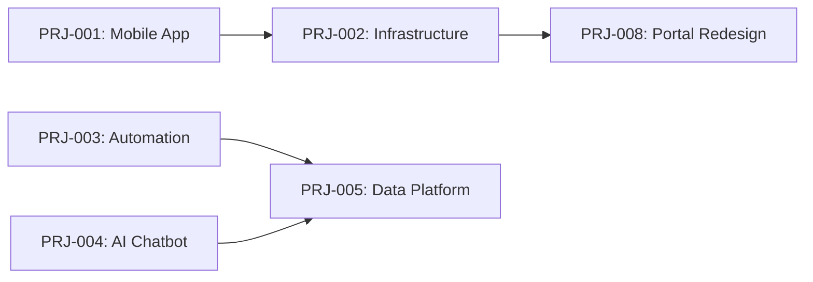

# 9) Portfolio y planificación

El Portfolio Layer del UDF es opcional y permite gestionar múltiples proyectos de forma coordinada, optimizando recursos, dependencias y alineación estratégica.

---

## Portfolio Layer

### Propósito

* **Alineación estratégica:** Vincular proyectos con OKRs y objetivos corporativos
* **Optimización de recursos:** Gestión de capacidad entre proyectos
* **Gestión de dependencias:** Identificar y resolver dependencias entre iniciativas
* **Consolidación de beneficios:** Visión agregada de valor y ROI

---

## Portfolio Structure

```
Enterprise Portfolio
├── Strategic Themes
│   ├── Digital Transformation
│   ├── Customer Experience
│   └── Operational Excellence
│
├── Programs
│   ├── Program A (multiple related projects)
│   ├── Program B
│   └── Program C
│
└── Projects
    ├── Project 1 (UDF instance)
    ├── Project 2 (UDF instance)
    └── Project 3 (UDF instance)
```

---

## Strategic Alignment with OKRs

### OKR Framework

```yaml
# portfolio_okrs.yaml
year: 2025

objectives:
  - id: O1
    title: "Become market leader in digital experience"
    owner: "CEO"
    
    key_results:
      - id: KR1.1
        description: "Increase customer satisfaction (NPS) from 42 to 65"
        target: 65
        current: 48
        progress: 26%
        
      - id: KR1.2
        description: "Launch 5 new digital products"
        target: 5
        current: 2
        progress: 40%
        
      - id: KR1.3
        description: "Achieve 99.9% platform availability"
        target: 99.9
        current: 99.7
        progress: 90%
    
    contributing_projects:
      - project_id: PRJ-001
        contribution: "Primary - Mobile app rebuild"
        alignment: 80%
        
      - project_id: PRJ-002
        contribution: "Supporting - Infrastructure upgrade"
        alignment: 60%

  - id: O2
    title: "Reduce operational costs by 20%"
    owner: "COO"
    
    key_results:
      - id: KR2.1
        description: "Automate 50% of manual processes"
        target: 50
        current: 28
        progress: 56%
        
      - id: KR2.2
        description: "Reduce infrastructure costs by $500K"
        target: 500000
        current: 180000
        progress: 36%
    
    contributing_projects:
      - project_id: PRJ-003
        contribution: "Primary - Process automation"
        alignment: 90%
```

### Project to OKR Mapping

| Project   | Strategic Theme       | Contributing OKR | Alignment Score |
| --------- | --------------------- | ---------------- | --------------- |
| PRJ-001   | Customer Experience   | O1.KR1.1, O1.KR1.2 | 80%           |
| PRJ-002   | Operational Excellence| O1.KR1.3, O2.KR2.2 | 70%           |
| PRJ-003   | Operational Excellence| O2.KR2.1         | 90%             |
| PRJ-004   | Digital Transformation| O1.KR1.2         | 75%             |

---

## Portfolio Roadmap

```markdown
# Portfolio Roadmap 2025

## Q1 2025

### Active Projects (5)
- **PRJ-001:** Mobile App Rebuild [Build Phase]
- **PRJ-002:** Infrastructure Upgrade [Validation Phase]
- **PRJ-003:** Process Automation [Planning Phase]
- **PRJ-004:** AI Chatbot [Initiation Phase]
- **PRJ-005:** Data Platform [Build Phase]

### Completed (2)
- PRJ-006: Auth Service Upgrade ✅
- PRJ-007: Payment Gateway Migration ✅

### Resource Allocation
- Developers: 45/50 (90% utilized)
- QA: 8/10 (80% utilized)
- DevOps: 4/5 (80% utilized)

## Q2 2025

### Planned Starts (3)
- PRJ-008: Customer Portal Redesign
- PRJ-009: Analytics Platform
- PRJ-010: Security Hardening

### Expected Completions (2)
- PRJ-002: Infrastructure Upgrade
- PRJ-004: AI Chatbot

### Resource Forecast
- Developers: 48/50 (96% - near capacity)
- QA: 9/10 (90%)
- DevOps: 5/5 (100% - at capacity)

## Dependencies


```

---

## Portfolio Dashboard

### Executive View

```markdown
# Portfolio Health Dashboard

**Period:** Q1 2025
**Last Updated:** 2025-10-21

## Portfolio Health: 🟢 Healthy

| Dimension        | Status | Score | Trend |
| ---------------- | ------ | ----- | ----- |
| Schedule         | 🟢     | 85%   | →     |
| Budget           | 🟡     | 72%   | ↓     |
| Quality (THI avg)| 🟢     | 78%   | ↑     |
| Strategic Align  | 🟢     | 82%   | →     |
| Resource Health  | 🟡     | 88%   | →     |

## Projects by Status

| Status           | Count | % of Portfolio |
| ---------------- | ----- | -------------- |
| 🟢 On Track      | 8     | 62%            |
| 🟡 At Risk       | 3     | 23%            |
| 🔴 Critical      | 2     | 15%            |
| **Total Active** | **13**| **100%**       |

## Budget Summary

- **Total Budget:** $5,000,000
- **Spent to Date:** $2,100,000 (42%)
- **Committed:** $1,800,000 (36%)
- **Available:** $1,100,000 (22%)
- **Forecast Variance:** +$150,000 (3% over)

## Top Risks

| Risk                              | Projects Affected | Impact | Mitigation Status |
| --------------------------------- | ----------------- | ------ | ----------------- |
| Resource capacity constraint      | PRJ-001, PRJ-008  | High   | 🟡 In Progress    |
| Vendor delivery delay             | PRJ-002           | Medium | 🟢 Mitigated      |
| Technology complexity             | PRJ-005           | High   | 🔴 Escalated      |

## Strategic Contribution

| OKR           | Target Progress | Actual Progress | Gap    |
| ------------- | --------------- | --------------- | ------ |
| O1.KR1.1 (NPS)| 50%             | 26%             | -24%   |
| O1.KR1.2      | 60%             | 40%             | -20%   |
| O2.KR2.1      | 50%             | 56%             | +6%    |
```

---

## Resource Management

### Capacity Planning

```yaml
# capacity_plan.yaml
period: Q2_2025

teams:
  development:
    total_capacity: 50
    allocated: 48
    available: 2
    utilization: 96%
    
    allocation:
      - project: PRJ-001
        fte: 12
        duration: 12_weeks
        
      - project: PRJ-003
        fte: 8
        duration: 16_weeks
        
      - project: PRJ-005
        fte: 15
        duration: 20_weeks
        
  qa:
    total_capacity: 10
    allocated: 9
    available: 1
    utilization: 90%
    
  devops:
    total_capacity: 5
    allocated: 5
    available: 0
    utilization: 100%
    alert: "At capacity - consider hiring or outsourcing"

constraints:
  - type: capacity
    team: devops
    severity: high
    impact: "May delay PRJ-008 start"
    
  - type: skillset
    team: development
    skill: "React Native"
    available: 3
    required: 5
    severity: medium
```

---

## Dependency Management

### Dependency Matrix

| Project   | Depends On | Type         | Status   | Risk  |
| --------- | ---------- | ------------ | -------- | ----- |
| PRJ-001   | PRJ-002    | Technical    | 🟢 Ready | Low   |
| PRJ-003   | PRJ-005    | Data         | 🟡 Partial| Med  |
| PRJ-004   | PRJ-005    | Data         | 🔴 Blocked| High |
| PRJ-008   | PRJ-002    | Infrastructure| 🟢 Ready| Low   |

### Critical Path Analysis

```
PRJ-002 (Infra) ──→ PRJ-001 (Mobile) ──→ Launch
     ↓
PRJ-008 (Portal)

PRJ-005 (Data) ──→ PRJ-003 (Automation)
     ↓
PRJ-004 (AI) ──→ Integration
```

**Critical Path:** PRJ-002 → PRJ-001 → Launch (16 weeks)
**Risk:** Any delay in PRJ-002 impacts launch date

---

## Portfolio Governance

### Portfolio Review Board

```markdown
# Portfolio Review Board

**Frequency:** Monthly
**Participants:**
- Portfolio Manager (Chair)
- Program Managers
- Project Managers
- Finance Representative
- Resource Manager
- Architecture Representative

## Agenda

1. **Portfolio Health Review** (15 min)
   - Overall status and trends
   - Budget and resource utilization
   - Risk summary

2. **Project Status Updates** (30 min)
   - Critical/At-risk projects deep dive
   - Escalations and decisions needed
   - Resource conflicts

3. **Strategic Alignment Review** (15 min)
   - OKR progress
   - Portfolio priorities
   - New initiatives evaluation

4. **Resource Planning** (15 min)
   - Capacity forecast
   - Skill gaps
   - Hiring/outsourcing decisions

5. **Decisions and Actions** (15 min)
   - Approvals needed
   - Action items
   - Next steps

## Decision Framework

| Decision Type           | Approval Level    |
| ----------------------- | ----------------- |
| Budget variance >10%    | CFO               |
| Resource reallocation   | Portfolio Manager |
| Project prioritization  | Executive Team    |
| New project approval    | Executive Team    |
| Project cancellation    | Sponsor + CFO     |
```

---

## Benefits Consolidation

### Portfolio Benefits Report

```markdown
# Portfolio Benefits Report - Q1 2025

## Realized Benefits

| Project | Expected      | Realized     | Achievement | Status |
| ------- | ------------- | ------------ | ----------- | ------ |
| PRJ-006 | +$200K revenue| +$180K       | 90%         | 🟢     |
| PRJ-007 | -$100K costs  | -$120K       | 120%        | 🟢     |
| PRJ-001 | +15 NPS       | +6 NPS       | 40%         | 🟡     |

## Projected Benefits (Next 12 months)

| Category          | Total Expected | Confidence |
| ----------------- | -------------- | ---------- |
| Revenue Growth    | +$2.5M         | Medium     |
| Cost Reduction    | -$800K         | High       |
| Customer Satisfaction | +25 NPS   | Medium     |
| Operational Efficiency| +40%      | High       |

## ROI Analysis

- **Total Investment:** $5,000,000
- **Expected Return (3 years):** $8,500,000
- **Net Benefit:** $3,500,000
- **ROI:** 70%
- **Payback Period:** 18 months
```

---

## Portfolio Prioritization

### Prioritization Matrix

| Project | Strategic Value | Risk  | Effort | Score | Priority |
| ------- | --------------- | ----- | ------ | ----- | -------- |
| PRJ-001 | 9               | 6     | 8      | 7.7   | P0       |
| PRJ-003 | 8               | 4     | 5      | 7.0   | P0       |
| PRJ-005 | 7               | 7     | 9      | 5.7   | P1       |
| PRJ-008 | 6               | 5     | 6      | 5.7   | P1       |
| PRJ-004 | 5               | 8     | 7      | 5.0   | P2       |

**Formula:** Score = (Strategic Value × 0.5) + ((10 - Risk) × 0.3) + ((10 - Effort) × 0.2)

---

[← Anterior: Product & Value](08-product-value.md) | [Siguiente: Learning Loop →](10-learning-loop.md)
