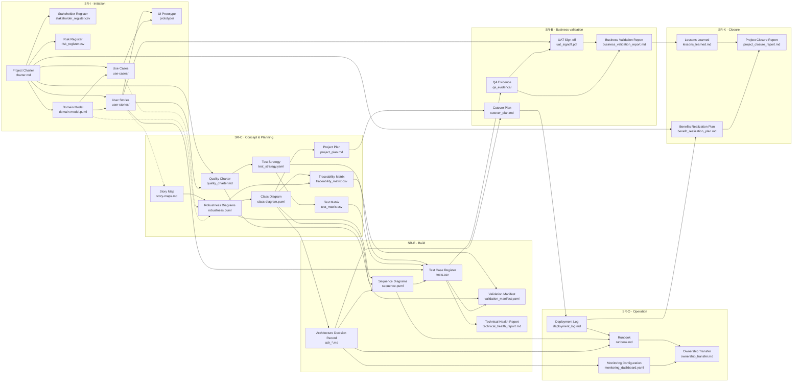

# 18) Mapeo de artefactos y dependencias (diagrama)

Este documento define **nombres para presentación** (inglés y español) para cada archivo convención del UDF y un **diagrama de dependencias entre artefactos** (no tareas): lectura **izquierda → derecha** por **fase** (SR-I … SR-X); dentro de cada columna el flujo típico es **de arriba abajo**.

**Convención de flechas:** A → B significa que *B se apoya en, deriva de o debe ser coherente con* A. Los ciclos de refinamiento (p. ej. prototipo que motiva nueva versión del charter) no se muestran para mantener el gráfico legible.

---

## Mapeo archivo → nombre para presentación

### Por fase (entregables principales)

| Archivo / ruta | Nombre (EN) | Nombre (ES) |
| ---------------- | ------------- | ------------- |
| `charter.md` | Project Charter | Charter del proyecto / Acta de constitución |
| `domain-model.puml` | Domain Model | Modelo de dominio |
| `use-cases/` | Use Cases | Casos de uso |
| `user-stories/` | User Stories | Historias de usuario |
| `prototype/` | UI Prototype | Prototipo de interfaz |
| `story-maps.md` | Story Map | Mapa de historias |
| `robustness.puml` | Robustness Diagrams | Diagramas de robustez |
| `class-diagram.puml` | Class Diagram | Diagrama de clases |
| `project_plan.md` | Project Plan | Plan de proyecto |
| `traceability_matrix.csv` | Traceability Matrix | Matriz de trazabilidad |
| `sequence.puml` | Sequence Diagrams | Diagramas de secuencia |
| `tests.csv` | Test Case Register | Registro de casos de prueba |
| `adr_<id>.md` | Architecture Decision Record (ADR) | Registro de decisiones de arquitectura (ADR) |
| `technical_health_report.md` | Technical Health Report | Informe de salud técnica |
| `validation_manifest.yaml` | Validation Manifest | Manifiesto de validación |
| `cutover_plan.md` | Cutover Plan | Plan de corte / puesta en marcha |
| `qa_evidence/` | QA Evidence Package | Evidencias de QA |
| `uat_signoff.pdf` | UAT Sign-off | Acta de aceptación de usuario (UAT) |
| `business_validation_report.md` | Business Validation Report | Informe de validación de negocio |
| `deployment_log.md` | Deployment Log | Registro de despliegues |
| `monitoring_dashboard.yaml` | Monitoring Configuration | Configuración de monitoreo / dashboards |
| `runbook.md` | Runbook | Manual operativo (runbook) |
| `ownership_transfer.md` | Ownership Transfer | Transferencia de responsabilidad operativa |
| `lessons_learned.md` | Lessons Learned | Lecciones aprendidas |
| `benefit_realization_plan.md` | Benefits Realization Plan | Plan de realización de beneficios |
| `project_closure_report.md` | Project Closure Report | Informe de cierre del proyecto |

### Gobierno y calidad (transversales)

| Archivo / ruta | Nombre (EN) | Nombre (ES) |
| ---------------- | ------------- | ------------- |
| `quality_charter.md` | Quality Charter | Carta de calidad |
| `architecture_governance_matrix.md` | Architecture Governance Matrix | Matriz de gobierno arquitectónico |
| `stage_review_board.md` | Stage Review Records | Actas de Stage Reviews |
| `risk_register.csv` | Risk Register | Registro de riesgos |
| `stakeholder_register.csv` | Stakeholder Register | Registro de partes interesadas |
| `status_report.md` | Status Report | Informe de estado |
| `executive_summary.md` | Executive Summary | Resumen ejecutivo |

### Testing (estrategia y políticas)

| Archivo / ruta | Nombre (EN) | Nombre (ES) |
| ---------------- | ------------- | ------------- |
| `test_strategy.yaml` | Test Strategy | Estrategia de pruebas |
| `test_matrix.csv` | Test Matrix | Matriz de pruebas |
| `qa_gate_policy.md` | QA Gate Policy | Política de gates de QA |
| `test_catalog.md` | Test Techniques Catalog | Catálogo de técnicas de prueba |

### Aprendizaje

| Archivo / ruta | Nombre (EN) | Nombre (ES) |
| ---------------- | ------------- | ------------- |
| `learning/<fecha>-<tema>.md` | Learning Log Entry | Entrada del ciclo de aprendizaje |
| `knowledge_base/` | Knowledge Base | Base de conocimiento |
| `tech_talks/` | Tech Talks | Charlas técnicas |

---

## Diagrama de dependencias (artefactos por fase)

Los nodos muestran **nombre en inglés** (presentación) y **archivo** en la segunda línea. Las aristas **punteadas** conectan fases con dependencias que cruzan el límite de la fase anterior.

### Notas al diagrama

* **Actas de Stage Review** (`stage_review_board.md`), **informes de estado** (`status_report.md`) y **resumen ejecutivo** (`executive_summary.md`) agregan evidencia de múltiples artefactos; no se enlazan desde cada nodo para no saturar el gráfico.
* **`validation_manifest.yaml`** aparece en Build y en la sección de testing del catálogo: en el diagrama es **un único artefacto**.
* **`architecture_governance_matrix.md`**, **`qa_gate_policy.md`**, **`test_catalog.md`** y aprendizaje (`learning/`, `knowledge_base/`, `tech_talks/`) pueden enlazarse en extensiones del mapa según PDI.

---

[← Anterior: Interoperabilidad y automatización](17-interoperabilidad-y-automatizacion.md) | [Volver a Artefactos](02-artifacts.md)
